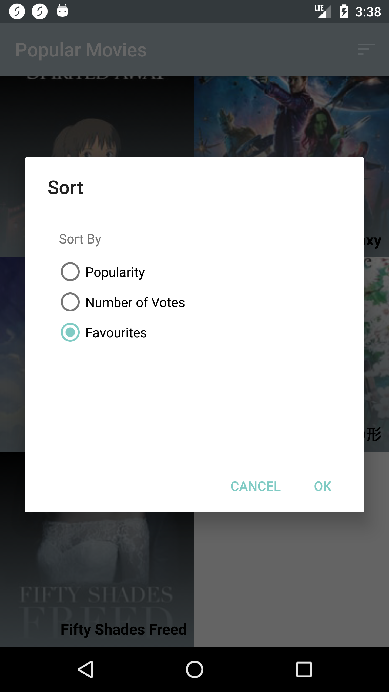
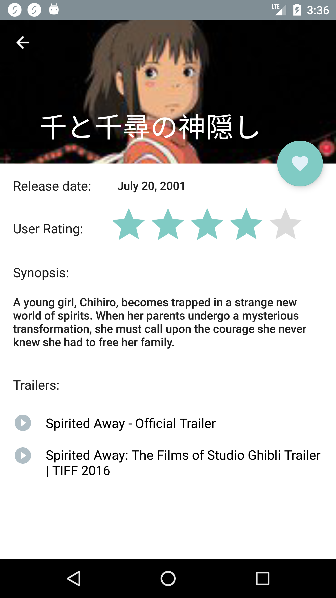
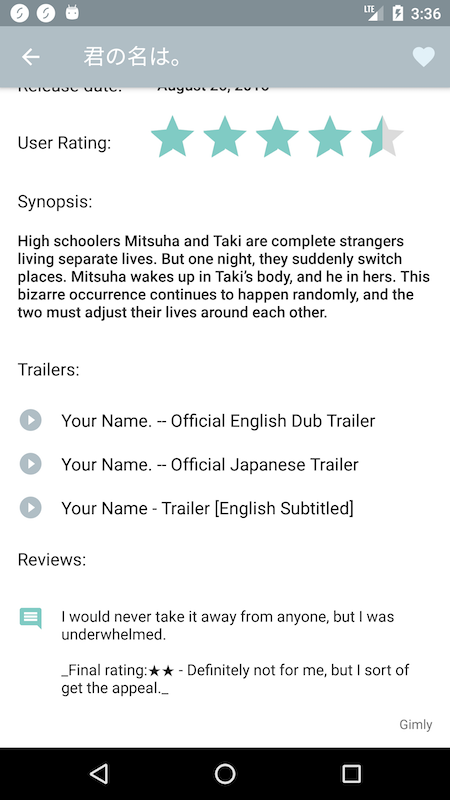

# PopularMovies 
Movies app created for Udacity's Android Nanodegree Course using theMovieDB API. 

**In order to use: Please add your API key as a string in the _gradle.properties_ file with the name "API_KEY"**

# PopularMovies Part 1
[Branch Part-1](https://github.com/novembergave/UdacityPopularMovies/tree/Part-1)

Fetch list of movies filtered by popularity or number of votes.
Display details of the movies in a separate detail activity.

*MainActivity*

   
    
*DetailActivity*

   
   
*DetailActivity with collapsed toolbar*

   

# PopularMovies Part 2 (master)
[Branch Part-2](https://github.com/novembergave/UdacityPopularMovies/tree/Part-2)

Add ability to save a movie to a list of favourites and filter to display the favourited items.
Favourites are saved in an SQLite database.
Fetch list of trailers and reviews for each movie and display this in the Detail Activity.
Save these lists in the savedInstanceState so that screen rotations etc does not trigger new network requests.

*MainActivity*

   
    
*DetailActivity*

   
   
*DetailActivity with collapsed toolbar*

   
