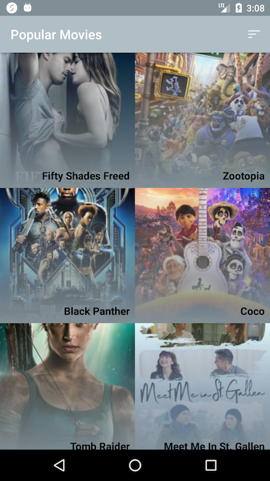
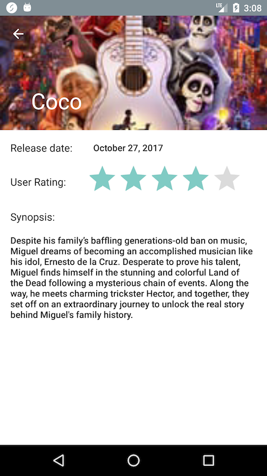
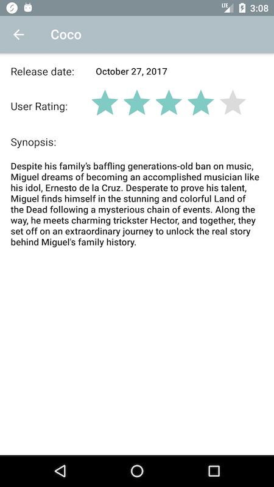

# PopularMovies Part 1
Movies app created for Udacity's Android Nanodegree Course using theMovieDB API. 

**In order to use: Please add your API key as a string in the _gradle.properties_ file with the name "API_KEY"**

*MainActivity*

   
    
*DetailActivity*

   
   
*DetailActivity with collapsed toolbar*

   

